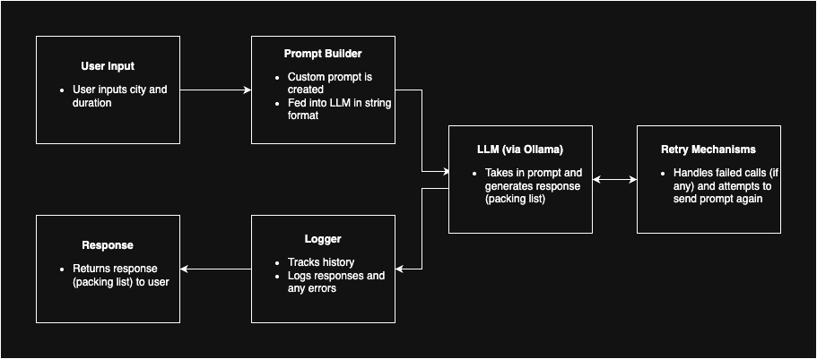

# AI Pipeline

This mini-project shows how AI workflows are orchestrated effectivelly to ensure reliable operations. The program generates a city-specific packing list using a local LLM via Ollama. The user will be prompted to enter the city they are traveling to and the duration in days. This will send a prompt to the LLM in the format: 

"I am traveling to {city} for {duration} days. Please help me generate a packing list considering the city's current season, weather, and customs."

The LLM will then generate a packing list. Logs containing previous responses will be saved for monitoring and retry mechanisms have also been implemented for reliability. The specific LLM used in this project is Llama 2. 

## Architecture

## Monitoring
The saved logs can be found in the logs folder where all errors and responses have been saved with time stamps. The monitoring folder contains a Jupyter notebook that reads from the logs and plots statistics. For example, I have plotted a bar chart showing the frequency of cities that have been prompted. Additionally, there is a pie chart that shows the percentage of successful and failed calls out of the total calls. 

## Example
Here is an example response generated when the user inputs 'Tokyo' and '5' which generates the prompt "I am traveling to Tokyo for 5 days. Please help me generate a packing list considering the city's current season, weather, and customs.

🎒 Suggested Packing List:

Of course! Here is a suggested packing list for your trip to Tokyo based on the current season, weather, and customs:

Clothing:

* Lightweight rain jacket or poncho (Tokyo can experience sudden rain showers, especially during spring)
* Breathable layers (such as t-shirts, tank tops, and long-sleeved shirts) for variable weather conditions
* Comfortable walking shoes or sneakers (you'll likely do a lot of walking in Tokyo)
* Dressier outfit for nicer restaurants or cultural events (if you plan on visiting any)

Toiletries:

* Toothbrush, toothpaste, and dental floss
* Shampoo, conditioner, and body wash
* Deodorant and sunscreen (Tokyo can be quite humid during spring)
* Any necessary medications or personal care items

Technology:

* Smartphone and charger (you'll likely want to stay connected while traveling)
* Portable charger or power bank (Tokyo's public Wi-Fi can be unreliable, so it's best to have a backup charge)
* Headphones or earbuds (for listening to music or podcasts during your commute)

Miscellaneous:

* Snacks and water bottle (to stay hydrated and energized throughout the day)
* Travel-size umbrella or rain poncho (just in case!)
* Pocket change in Japanese yen (some small shops or street vendors may not accept credit cards)
* Basic Japanese phrases or a translation guide (showing respect for local customs and language can go a long way)

Additionally, it's a good idea to research any specific cultural dos and don'ts for Tokyo, as they can vary from other destinations. Have a safe and enjoyable trip!